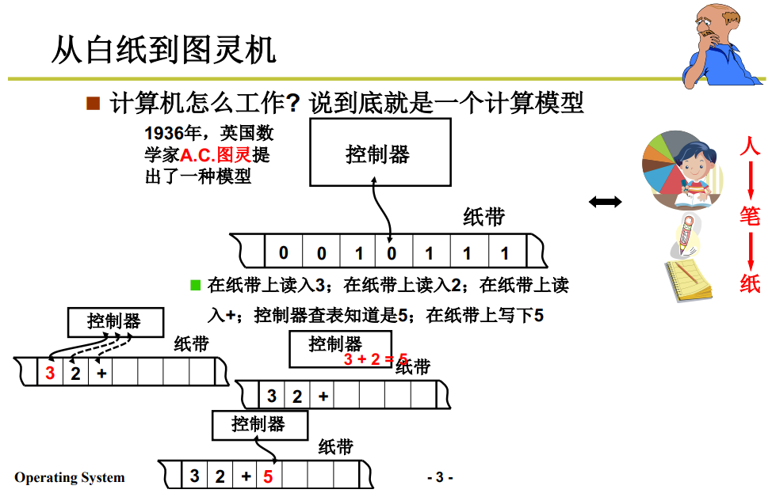
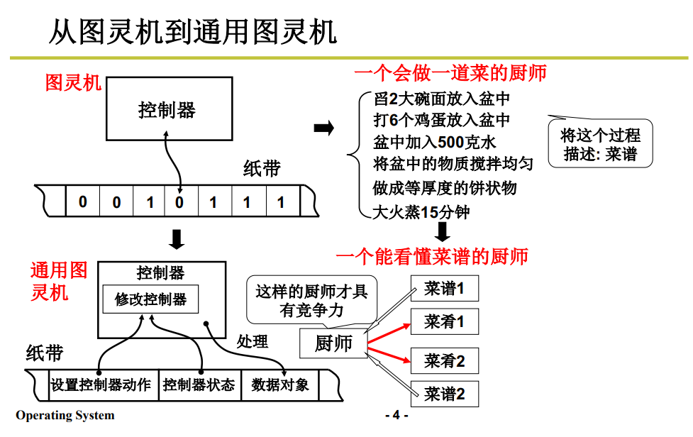
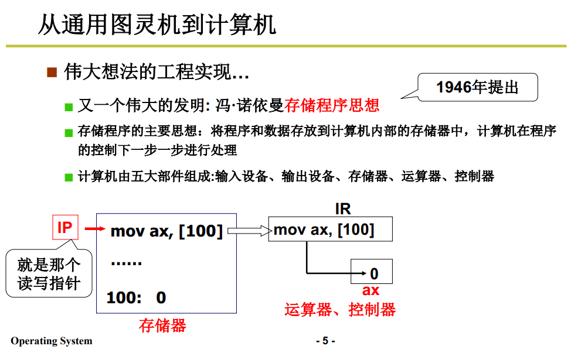
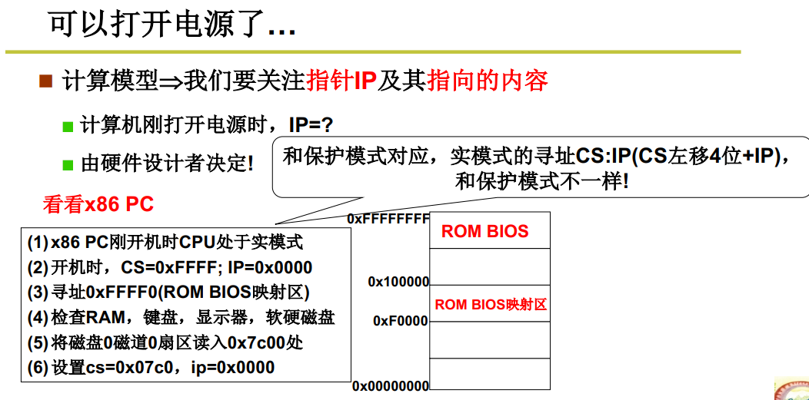
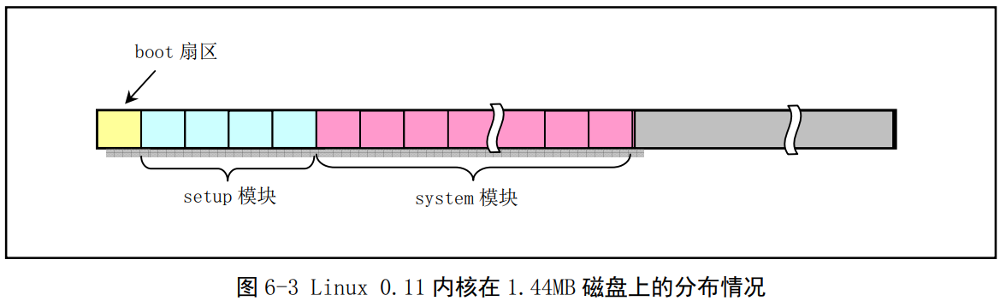
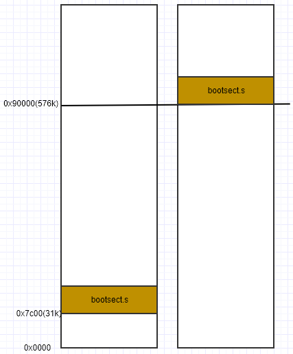

# 操作系统启动
## 从白纸到图灵机



## 从图灵机到通用图灵机


## 从通用图灵机到计算机


## 打开电源，计算机执行的第一句指令什么?



## bootsect.s

`bootsect.s` 是磁盘引导块程序，驻留在磁盘的第一个扇区中(引导扇区，0 磁道(柱面)，0 磁头，第一个扇区)。在 PC 加电 ROM BIOS 自检后，ROM BIOS 会把引导扇区代码 bootsect 加载到内存地址 0x7c00 开始处并执行。




### `bootsect.s` 部分代码分析：

```
SETUPLEN = 4				! nr of setup-sectors
BOOTSEG  = 0x07c0			! original address of boot-sector
INITSEG  = 0x9000			! we move boot here - out of the way
SETUPSEG = 0x9020			! setup starts here
SYSSEG   = 0x1000			! system loaded at 0x10000 (65536).
ENDSEG   = SYSSEG + SYSSIZE	! where to stop loading

entry _start
_start:
	mov	ax,#BOOTSEG     ! 将 ds 的段寄存器设置为 0x07c0
	mov	ds,ax
	mov	ax,#INITSEG     ! 将 es 的段寄存器设置为 0x9000
	mov	es,ax
	mov	cx,#256         ! 设置移动字数值为 256字
	sub	si,si           ! 源地址为: ds:si = 0x07c0:0x0000
	sub	di,di           ! 目的址为: es:di = 0x9000:0x0000
	rep                 ! 重复执行并递减 cx 的值，直到 cx = 0 为止
	movw                ! 即 movs 指令，从内存 [si] 处，移动 256 字到内存 [di] 处。
	jmpi	go,INITSEG  ! 段间跳转(Jump Intersegment); 这里的 INITSEG 指要跳到的段地址，
                        ! 标号 go 是偏移地址
```

这里注意：段地址是要左移 4 位的即：

源地址为: 0x07c0 << 4 + 0x0000
目的址为: 0x9000 << 4 + 0x0000

上面的代码做了将 `bootsect.s` 代码从 `0x07c0` 移动到 `0x90000` 处，如下图：




## 参考
- [linux源码阅读笔记 jmpi指令](https://luogantt.blog.csdn.net/article/details/126836483?spm=1001.2101.3001.6650.10&utm_medium=distribute.pc_relevant.none-task-blog-2%7Edefault%7EBlogCommendFromBaidu%7ERate-11-126836483-blog-5735747.pc_relevant_default&depth_1-utm_source=distribute.pc_relevant.none-task-blog-2%7Edefault%7EBlogCommendFromBaidu%7ERate-11-126836483-blog-5735747.pc_relevant_default&utm_relevant_index=11)
- [操作系统实验一到实验九合集(哈工大李治军)](https://blog.csdn.net/leoabcd12/article/details/122268321)
- [什么是段寄存器，数据寄存器](https://blog.csdn.net/happylzs2008/article/details/105243075?spm=1001.2101.3001.6650.1&utm_medium=distribute.pc_relevant.none-task-blog-2%7Edefault%7ECTRLIST%7ERate-1-105243075-blog-127131196.pc_relevant_recovery_v2&depth_1-utm_source=distribute.pc_relevant.none-task-blog-2%7Edefault%7ECTRLIST%7ERate-1-105243075-blog-127131196.pc_relevant_recovery_v2&utm_relevant_index=2)
