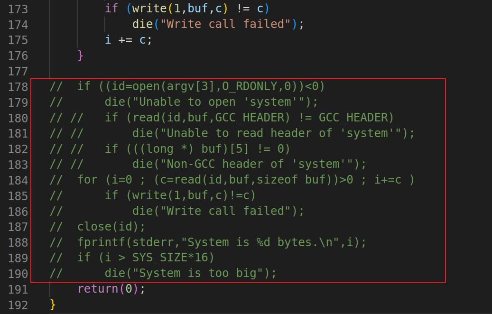
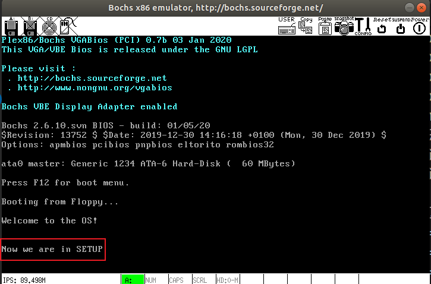

## la1 实验
### 0x01 修改启动是打印的开机 Logo 信息
> 要求：修改目前在屏幕上显示的开机 Logo 信息，要求显示一段自己设计的提示信息。比如 "LOS is booting ..."。

在这之前首先介绍一下 `int 0x10` 中断

| AH | 功能 | 调用参数 | 返回参数 |
| -- | --   |   --    |    --   |
| 03 |读光标位置 | BH = 页号 | CH = 光标开始行<br/>CL = 光标结束行<br/>DH = 行、DL = 列|
|13| 显示字符串|ES:BP = 串地址<br/>CX = 串长度<br/>DH DL = 起始行列、BH = 页号<br/>AL = 0，BL = 属性 串：Char，char，……，char 显示后光标位置不变<br/>AL = 1，BL = 属性 串：Char，char，……，char 显示后，光标位置改变<br/>

**改写 bootsect.s**

完整代码如下：

```arm
entry _start
_start:
    mov ah,#0x03        ! 设置功能号
    xor bh,bh           ! 将bh置0
    int 0x10            ! 返回行号和列号，供显示串用
    mov cx,#24          ！要显示的字符串长度
    mov bx,#0x0007      ! bh=0,bl=07(正常的黑底白字)
    mov bp,#msg1        ! es:bp 要显示的字符串物理地址
    mov ax,#0x07c0      ! 将es段寄存器置为#0x07c0
    mov es,ax           
    mov ax,#0x1301      ! ah=13(设置功能号),al=01(目标字符串仅仅包含字符，属性在BL中包含，光标停在字符串结尾处)
    int 0x10            ! 显示字符串

! 设置一个无限循环(纯粹为了能一直看到字符串显示)
inf_loop:
    jmp inf_loop

! 字符串信息
msg1:
    .byte   13,10           ! 换行+回车
    .ascii  "Welcome to the OS!"
    .byte   13,10,13,10     ! 换行+回车

! 将
.org 510

! 启动盘具有有效引导扇区的标志。仅供BIOS中的程序加载引导扇区时识别使用。它必须位于引导扇区的最后两个字节中
boot_flag:
    .word   0xAA55
```
`msg1` 修改为 `Welcome to the OS!` 加上换行和回车长度一共 `24`。

将 `.org 508` 修改为 `.org 510`，是因为这里不需要 `root_dev: .word ROOT_DEV`，为了保证 `boot_flag` 一定在引导扇区最后两个字节，所以要修改 `.org`。`.org 510` 表示下面语句从地址 `510(0x1FE)` 开始，用来强制要求 `boot_flag` 一定在引导扇区的最后 `2 `个字节中（`第511和512字节`）。

从终端进入 ~/oslab/linux-0.11/boot/目录，并执行下面两个命令：

```
$ as86 -0 -a -o bootsect.o bootsect.s
$ ld86 -0 -s -o bootsect bootsect.o
```


其中 `bootsect.o` 是中间文件。`bootsect` 是编译、链接后的目标文件。

需要留意的文件是 `bootsect` 的文件大小是 `544` 字节，而引导程序必须要正好占用一个磁盘扇区，即 `512` 个字节。造成多了 `32` 个字节的原因是 `ld86 产生的是 `Minix 可执行文件格式，这样的可执行文件处理文本段、数据段等部分以外，还包括一个 `Minix` 可执行文件头部，它的结构如下：

```c
struct exec {
    unsigned char a_magic[2];  //执行文件魔数
    unsigned char a_flags;
    unsigned char a_cpu;       //CPU标识号
    unsigned char a_hdrlen;    //头部长度，32字节或48字节
    unsigned char a_unused;
    unsigned short a_version;
    long a_text; long a_data; long a_bss; //代码段长度、数据段长度、堆长度
    long a_entry;    //执行入口地址
    long a_total;    //分配的内存总量
    long a_syms;     //符号表大小
};
```

6 char（6 字节）+ 1 short（2 字节） + 6 long（24 字节）= 32，正好是 32 个字节，去掉这 32 个字节后就可以放入引导扇区了。

对于上面的 `Minix` 可执行文件，其 `a_magic[0]=0x01`，`a_magic[1]=0x03`，`a_flags=0x10`（可执行文件），`a_cpu=0x04`（表示 `Intel i8086/8088`，如果是 `0x17` 则表示 `Sun` 公司的 `SPARC`），所以 `bootsect` 文件的头几个字节应该是 `01 03 10 04`。为了验证一下，`Ubuntu` 下用命令 `hexdump -C bootsect` 可以看到：


去掉这 32 个字节的文件头部:

```
$ dd bs=1 if=bootsect of=Image skip=32
```

生成的 Image 就是去掉文件头的 bootsect。去掉这 32 个字节后，将生成的文件拷贝到 linux-0.11 目录下，并一定要命名为“Image”（注意大小写）。然后就“run”吧！


注意上面写了死循环：

```arm
! 设置一个无限循环(纯粹为了能一直看到字符串显示)
inf_loop:
    jmp inf_loop
```

你可能无法关闭 `boch`，请使用 `ps -ef | grep 'boch'` 命令查询对应进程号，使用 `kill` 关闭。

### 0x02 完成 setup 文件的载入并跳转执行打印信息
> ① 要求：`bootsect.s` 能完成 `setup.s` 的载入，并跳转到 `setup.s` 开始地址执行，在 `setup.s` 开始执行时，需要向屏幕输出一行 `Now we are in SETUP` 信息。

`setup.s` 直接拷贝 `bootsect.s` 如下：

```arm
.globl begtext, begdata, begbss, endtext, enddata, endbss
.text
begtext:
.data
begdata:
.bss
begbss:
.text

! entry start
! start:

entry _start
_start:
	mov ah,#0x03
	xor bh,bh
	int 0x10
	mov cx,#25
	mov bx,#0x0007
	mov bp,#msg2
	mov ax,cs				! 这里的cs其实就是这段代码的段地址
	mov es,ax
	mov ax,#0x1301
	int 0x10
inf_loop:
	jmp inf_loop
msg2:
	.byte	13,10
	.ascii	"Now we are in SETUP"
	.byte	13,10,13,10
.org 510
boot_flag:
	.word	0xAA55
	
.text
endtext:
.data
enddata:
.bss
endbss:
```

接下来需要编写 `bootsect.s` 中载入 `setup.s` 的关键代码。所有需要的功能在原版 `bootsect.s` 中都是存在的，我们要做的仅仅是将这些代码添加到新的 `bootsect.s` 中去。

除了新增代码，我们还需要去掉在 `bootsect.s` 添加的无限循环。

```arm
.globl begtext, begdata, begbss, endtext, enddata, endbss
.text
begtext:
.data
begdata:
.bss
begbss:
.text

SETUPLEN = 1				! nr of setup-sectors
BOOTSEG  = 0x07c0			! original address of boot-sector
SETUOLEN=2              ! 读入的扇区数
SETUPSEG=0x07e0         ! setup代码的段地址
entry _start
_start:
    mov ah,#0x03        ! 设置功能号
    xor bh,bh           ! 将bh置0
    int 0x10            ! 返回行号和列号，供显示串用
    mov cx,#24          ! 要显示的字符串长度
    mov bx,#0x0007      ! bh=0,bl=07(正常的黑底白字)
    mov bp,#msg1        ! es:bp 要显示的字符串物理地址
    mov ax,#0x07c0      ! 将es段寄存器置为#0x07c0
    mov es,ax           
    mov ax,#0x1301      ! ah=13(设置功能号),al=01(目标字符串仅仅包含字符，属性在BL中包含，光标停在字符串结尾处)
    int 0x10            ! 显示字符串
! 下面开始利用 BIOS 的中断 INT 13，将 setup 程序从磁盘的第二扇区
! 开始读到 0x90200 处，工读 4 个扇区。
! 如果读错，则复位驱动器并重试，没有退路。
! INT 13 中断的使用方法如下：
! 读扇区：
! ah = 0x02（读磁盘扇区到内存） al = 需要读出的扇区数量
! ch = 磁道(柱面)               cl = 开始扇区(位 0 ~ 5)，磁道号高 2 位(位 6 ~ 7)
! dh = 磁头号                   dl = 驱动器号(如果是硬盘则位 7 要置位)
! es:bx 指向数据缓冲区
! 将setup模块从磁盘的第二个扇区开始读到0x7e00
load_setup:
    mov dx,#0x0000                  ! 磁头=0；驱动器号=0
    mov cx,#0x0002                  ! 磁道=0；扇区=2
    mov bx,#0x0200                  ! 偏移地址
    mov ax,#0x0200+SETUPLEN         ! 设置功能号；需要读出的扇区数量
    int 0x13                        ! 读磁盘扇区到内存
    jnc ok_load_setup               ! CF=0(读入成功)跳转到ok_load_setup  
    mov dx,#0x0000                  ! 如果读入失败，使用功能号ah=0x00————磁盘系统复位
    mov ax,#0x0000
    int 0x13
    jmp load_setup                  ! 尝试重新读入

ok_load_setup:
    jmpi    0,SETUPSEG              ! 段间跳转指令，跳转到setup模块处(0x07e0:0000)

! 字符串信息
msg1:
    .byte   13,10           ! 换行+回车
    .ascii  "Welcome to the OS!"
    .byte   13,10,13,10     ! 换行+回车

! 将
.org 510

! 启动盘具有有效引导扇区的标志。仅供BIOS中的程序加载引导扇区时识别使用。它必须位于引导扇区的最后两个字节中
boot_flag:
    .word   0xAA55

.text
endtext:
.data
enddata:
.bss
endbss:
```

开始编译:

```
$ make BootImage
```

有错误：

```
as86 -0 -a -o boot/bootsect.o boot/bootsect.s
ld86 -0 -s -o boot/bootsect boot/bootsect.o
as86 -0 -a -o boot/setup.o boot/setup.s
ld86 -0 -s -o boot/setup boot/setup.o
gcc -m32 -g -Wall -O2 -fomit-frame-pointer  \
-o tools/build tools/build.c
tools/build boot/bootsect boot/setup none  > Image
Root device is (3, 1)
Boot sector 512 bytes.
Setup is 364 bytes.
Unable to open 'system'
Makefile:54: recipe for target 'BootImage' failed
make: *** [BootImage] Error 1
```

这是因为 `make` 根据 `Makefile` 的指引执行了 `tools/build.c`，它是为生成整个内核的镜像文件而设计的，没考虑我们只需要 `bootsect.s` 和 `setup.s` 的情况。它在向我们要 “系统” 的核心代码。为完成实验，接下来给它打个小补丁。

`build.c` 从命令行参数得到 `bootsect`、`setup` 和 `system` 内核的文件名，将三者做简单的整理后一起写入 `Image`。其中 `system` 是第三个参数（`argv[3]`）。当 `make all` 或者 `makeall` 的时候，这个参数传过来的是正确的文件名，`build.c` 会打开它，将内容写入 `Image`。而 `make BootImage` 时，传过来的是字符串 `none`。所以，改造 `build.c` 的思路就是当 `argv[3]` 是 `none` 的时候，只写 `bootsect` 和 `setup`，忽略所有与 `system` 有关的工作，或者在该写 `system` 的位置都写上 `0`。

修改工作主要集中在 `build.c` 的尾部，可长度以参考下面的方式，将圈起来的部分注释掉:



重新编译即可：

```
$ make BootImage
$ ../run
```



> ② `setup.s` 获取一个基本硬件参数--扩展内存大小，并将其输出到屏幕上


## 参考

- [汇编中的10H中断int 10h详细说明](https://www.itzhai.com/assembly-int-10h-description.html)
- [BIOS INT 10中断功能详解](https://blog.csdn.net/qq_28256699/article/details/121103977)
- [BIOS INT 10-13功能调用的“另类”玩法(显示颜色)](https://www.cnblogs.com/ljf9201314/archive/2008/07/21/1247653.html)
- [操作系统实验一到实验九合集(哈工大李治军)](https://blog.csdn.net/leoabcd12/article/details/122268321)
