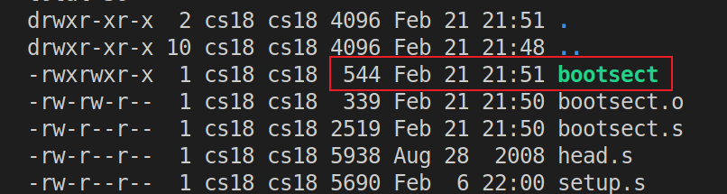
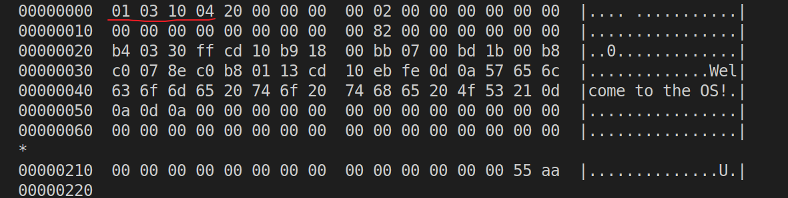
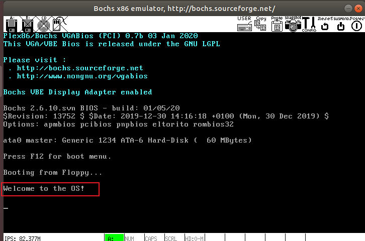

## la1 实验
### 0x01 修改启动是打印的开机 Logo 信息
> 要求：修改目前在屏幕上显示的开机 Logo 信息，要求显示一段自己设计的提示信息。比如 "LOS is booting ..."。

在这之前首先介绍一下 `int 0x10` 中断

| AH | 功能 | 调用参数 | 返回参数 |
| -- | --   |   --    |    --   |
| 03 |读光标位置 | BH = 页号 | CH = 光标开始行<br/>CL = 光标结束行<br/>DH = 行、DL = 列|
|13| 显示字符串|ES:BP = 串地址<br/>CX = 串长度<br/>DH DL = 起始行列、BH = 页号<br/>AL = 0，BL = 属性 串：Char，char，……，char 显示后光标位置不变<br/>AL = 1，BL = 属性 串：Char，char，……，char 显示后，光标位置改变<br/>

**改写 bootsect.s**

完整代码如下：

```arm
entry _start
_start:
    mov ah,#0x03        ! 设置功能号
    xor bh,bh           ! 将bh置0
    int 0x10            ! 返回行号和列号，供显示串用
    mov cx,#24          ！要显示的字符串长度
    mov bx,#0x0007      ! bh=0,bl=07(正常的黑底白字)
    mov bp,#msg1        ! es:bp 要显示的字符串物理地址
    mov ax,#0x07c0      ! 将es段寄存器置为#0x07c0
    mov es,ax           
    mov ax,#0x1301      ! ah=13(设置功能号),al=01(目标字符串仅仅包含字符，属性在BL中包含，光标停在字符串结尾处)
    int 0x10            ! 显示字符串

! 设置一个无限循环(纯粹为了能一直看到字符串显示)
inf_loop:
    jmp inf_loop

! 字符串信息
msg1:
    .byte   13,10           ! 换行+回车
    .ascii  "Welcome to the OS!"
    .byte   13,10,13,10     ! 换行+回车

! 将
.org 510

! 启动盘具有有效引导扇区的标志。仅供BIOS中的程序加载引导扇区时识别使用。它必须位于引导扇区的最后两个字节中
boot_flag:
    .word   0xAA55
```
`msg1` 修改为 `Welcome to the OS!` 加上换行和回车长度一共 `24`。

将 `.org 508` 修改为 `.org 510`，是因为这里不需要 `root_dev: .word ROOT_DEV`，为了保证 `boot_flag` 一定在引导扇区最后两个字节，所以要修改 `.org`。`.org 510` 表示下面语句从地址 `510(0x1FE)` 开始，用来强制要求 `boot_flag` 一定在引导扇区的最后 `2 `个字节中（`第511和512字节`）。

从终端进入 ~/oslab/linux-0.11/boot/目录，并执行下面两个命令：

```
$ as86 -0 -a -o bootsect.o bootsect.s
$ ld86 -0 -s -o bootsect bootsect.o
```


其中 `bootsect.o` 是中间文件。`bootsect` 是编译、链接后的目标文件。

需要留意的文件是 `bootsect` 的文件大小是 `544` 字节，而引导程序必须要正好占用一个磁盘扇区，即 `512` 个字节。造成多了 `32` 个字节的原因是 `ld86 产生的是 `Minix 可执行文件格式，这样的可执行文件处理文本段、数据段等部分以外，还包括一个 `Minix` 可执行文件头部，它的结构如下：

```c
struct exec {
    unsigned char a_magic[2];  //执行文件魔数
    unsigned char a_flags;
    unsigned char a_cpu;       //CPU标识号
    unsigned char a_hdrlen;    //头部长度，32字节或48字节
    unsigned char a_unused;
    unsigned short a_version;
    long a_text; long a_data; long a_bss; //代码段长度、数据段长度、堆长度
    long a_entry;    //执行入口地址
    long a_total;    //分配的内存总量
    long a_syms;     //符号表大小
};
```

6 char（6 字节）+ 1 short（2 字节） + 6 long（24 字节）= 32，正好是 32 个字节，去掉这 32 个字节后就可以放入引导扇区了。

对于上面的 `Minix` 可执行文件，其 `a_magic[0]=0x01`，`a_magic[1]=0x03`，`a_flags=0x10`（可执行文件），`a_cpu=0x04`（表示 `Intel i8086/8088`，如果是 `0x17` 则表示 `Sun` 公司的 `SPARC`），所以 `bootsect` 文件的头几个字节应该是 `01 03 10 04`。为了验证一下，`Ubuntu` 下用命令 `hexdump -C bootsect` 可以看到：



去掉这 32 个字节的文件头部:

```
$ dd bs=1 if=bootsect of=Image skip=32
```

生成的 Image 就是去掉文件头的 bootsect。去掉这 32 个字节后，将生成的文件拷贝到 linux-0.11 目录下，并一定要命名为“Image”（注意大小写）。然后就“run”吧！



注意上面写了死循环：

```arm
! 设置一个无限循环(纯粹为了能一直看到字符串显示)
inf_loop:
    jmp inf_loop
```

你可能无法关闭 `boch`，请使用 `ps -ef | grep 'boch'` 命令查询对应进程号，使用 `kill` 关闭。

### 0x02 完成 setup 文件的载入并跳转执行打印信息
> 要求：`bootsect.s` 能完成 `setup.s` 的载入，并跳转到 `setup.s` 开始地址执行，在 `setup.s` 开始执行时，需要向屏幕输出一行 `Now we are in SETUP` 信息。


## 参考

- [汇编中的10H中断int 10h详细说明](https://www.itzhai.com/assembly-int-10h-description.html)
- [BIOS INT 10中断功能详解](https://blog.csdn.net/qq_28256699/article/details/121103977)
- [BIOS INT 10-13功能调用的“另类”玩法(显示颜色)](https://www.cnblogs.com/ljf9201314/archive/2008/07/21/1247653.html)
- [操作系统实验一到实验九合集(哈工大李治军)](https://blog.csdn.net/leoabcd12/article/details/122268321)
